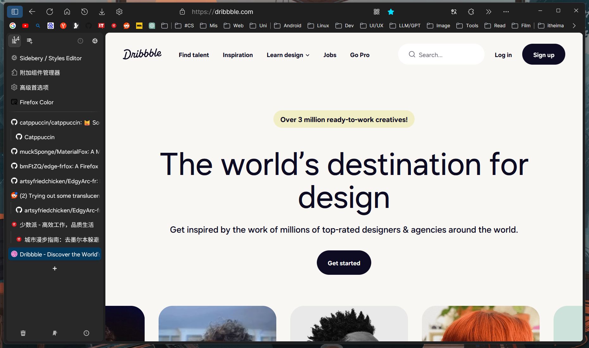
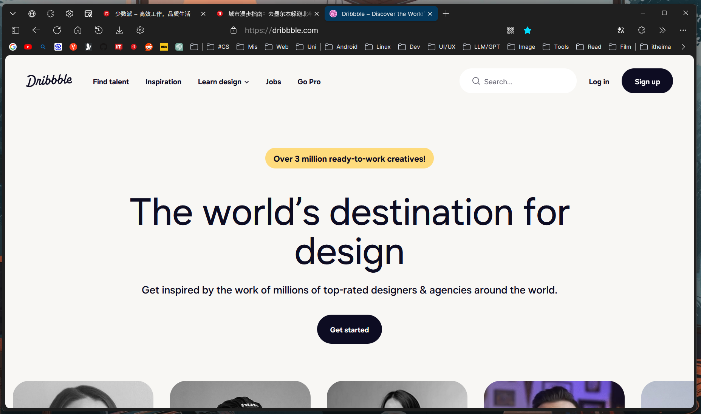
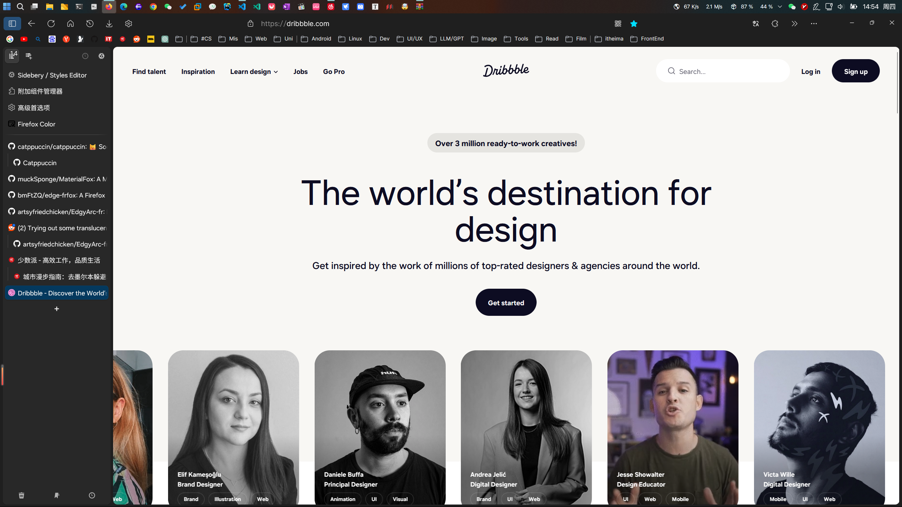
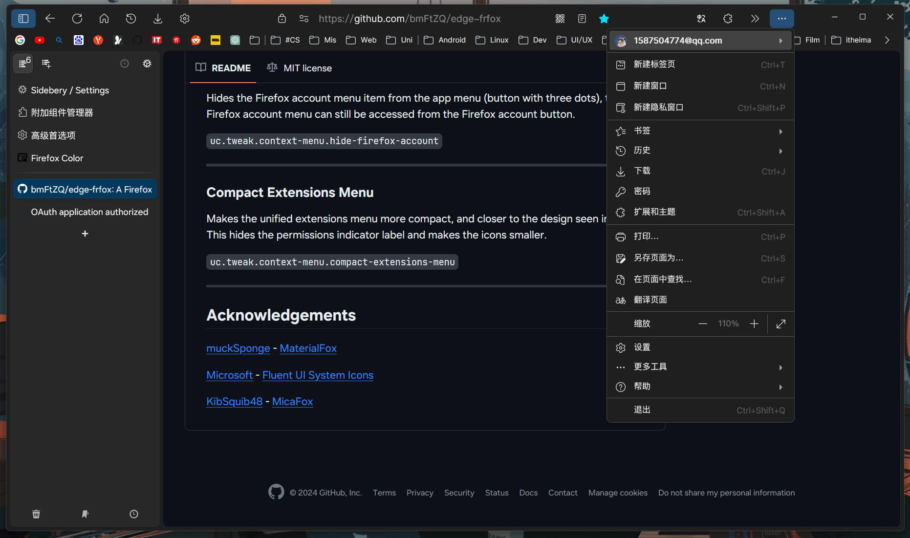

# MyFirefoxCustomCSSConfig
使用用户CSS样式与用户脚本高度自定义火狐浏览器

## 变更
- 为Firefox增加侧栏垂直标签页
- 使用基于VSCode Modern Dark Theme的配色方案
- 使UI贴近Arc Browser/Microsoft Edge Browser

## 基于
- Firefox 122.0.1
- Firefox Color
- [EdgeFrFox UserChrome Theme](https://github.com/bmFtZQ/edge-frfox/) - A sleek user interface theme for Firefox.
- [Sidebery](https://addons.mozilla.org/firefox/addon/sidebery/) - Enhanced sidebar manager for Firefox.

